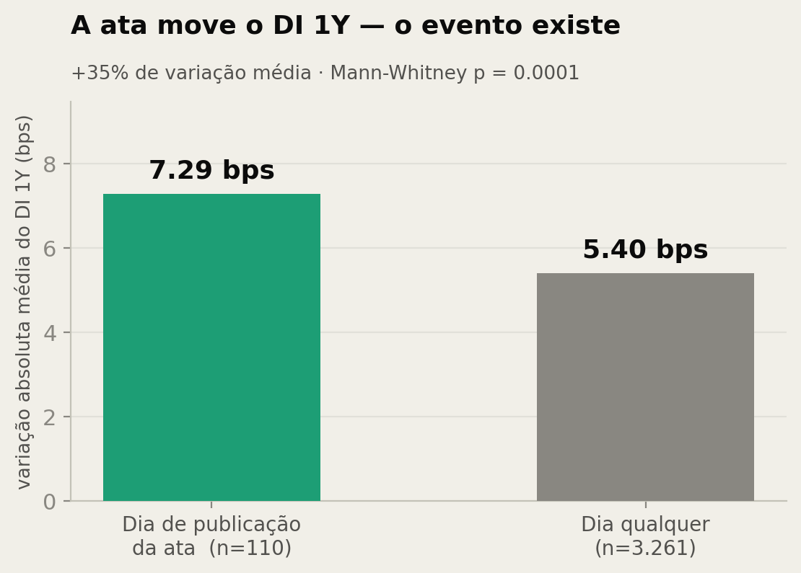
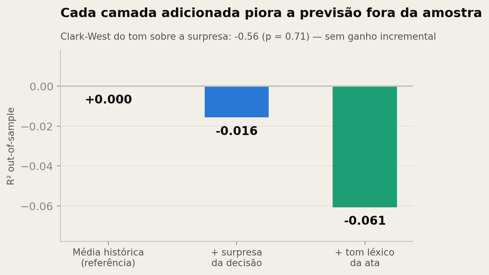
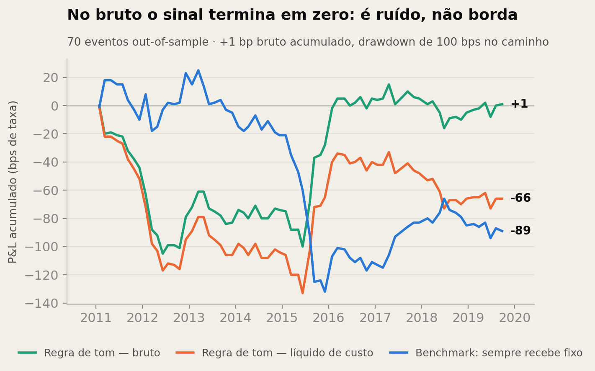
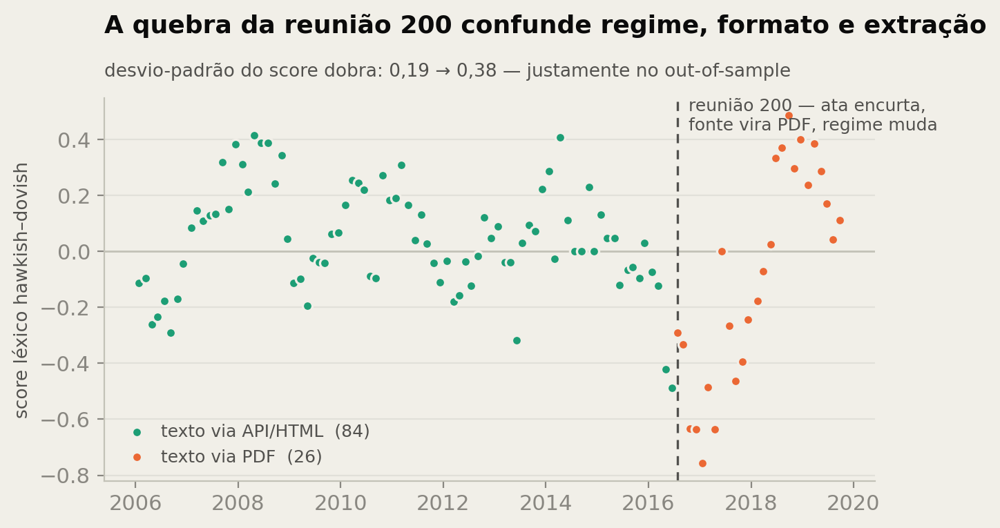

# CopomLens — Resultados

> Toda linha desta página é gerada por `scripts/analise/01..05`, na ordem, a
> partir do painel point-in-time. Nenhum número foi digitado à mão. Os artefatos
> ficam em `data/processed/analise/` e as figuras em `docs/assets/`.

## O achado em uma frase

A publicação da ata **é** um evento de mercado — o DI 1Y se move 35% mais nesse
dia do que num dia qualquer, com p = 0,0001. Mas **a direção do movimento não é
prevista** nem pela surpresa da decisão nem pelo tom léxico da ata: no
out-of-sample o P&L bruto acumulado é de +1 bp em 70 trades, e o custo de
travessia transforma isso em −66 bps. A hipótese foi testada e **rejeitada** na
camada léxica.

## 1. O evento existe

| | dia de publicação da ata | dia qualquer |
| --- | --- | --- |
| n | 110 | 3.261 |
| variação absoluta média do DI 1Y | **7,29 bps** | 5,40 bps |
| desvio-padrão | 10,01 bps | 9,02 bps |

Razão de volatilidade 1,109 · Mann-Whitney (ata > normal) **p = 0,0001** ·
Levene p = 0,088.

O prêmio de volatilidade do dia da ata é real e estatisticamente sólido. É a
condição necessária da estratégia — e ela **passa**. O que falha é a etapa
seguinte.



## 2. Comparação aninhada walk-forward

Janela expansiva, refit a cada evento, treino mínimo de 40 eventos.
**70 previsões out-of-sample**, de 27/01/2011 a 24/09/2019.
Desvio-padrão da reação a explicar: 10,27 bps.

| modelo | RMSE (bps) | R² out-of-sample | corr(previsto, real) |
| --- | --- | --- | --- |
| M0 — média histórica | 10,295 | 0,0000 | −0,201 |
| M1 — + surpresa da decisão | 10,376 | **−0,0157** | −0,151 |
| M2 — + tom léxico da ata | 10,603 | **−0,0607** | −0,152 |

Clark-West (teste próprio para modelos aninhados, unicaudal):

| comparação | estatística | p |
| --- | --- | --- |
| M1 sobre M0 | −1,131 | 0,871 |
| M2 sobre M1 | −0,558 | 0,712 |

**Nenhum ganho incremental.** Cada camada adicionada piora a previsão fora da
amostra. A correlação negativa entre previsto e realizado é a assinatura
clássica de relação ajustada que se inverte fora da amostra.

Dentro da amostra (OLS, erros HAC, 3 defasagens): R² = 0,023, com `lex_score`
p = 0,098 e `lex_delta` p = 0,093 — marginal, e não sobrevive ao teste honesto.



### Por que a surpresa não funciona aqui

`surpresa_decisao` é diferente de zero em apenas **24 dos 110 eventos** — o
Focus acerta a decisão em 78% das reuniões — e correlaciona 0,052 com a reação.
Há uma razão econômica antes da estatística: a ata sai **8 dias depois** da
decisão. No momento em que ela é publicada, a surpresa da decisão já é notícia
velha, integralmente precificada. Medir a surpresa no evento da ata testa a
especificação errada; o teste certo dela é no evento do **comunicado**.

Isso não é um defeito do dado — é um resultado sobre o desenho do experimento, e
está na lista de próximos passos.

## 3. Backtest

Cada publicação de ata é um trade: entra no fechamento anterior (D0), sai no
fechamento do dia da publicação. Convenção: **+1 paga fixo** (ganha com alta de
taxa), **−1 recebe fixo**. P&L em bps de taxa capturada, custo de travessia de
1 bp por trade. 70 eventos out-of-sample.

| estratégia | trades | bruto (bps) | líquido (bps) | Sharpe líq. | MaxDD | hit | p permutação |
| --- | --- | --- | --- | --- | --- | --- | --- |
| S3 — regra do Δ tom | 67 | **+1** | −66 | −0,265 | −133 | 0,373 | 0,489 |
| S4 — regra do nível de tom | 66 | −26 | −92 | −0,370 | −117 | 0,424 | 0,620 |
| S2 — previsão surpresa + tom | 70 | −41 | −111 | −0,437 | −114 | 0,386 | 0,721 |
| S1 — previsão só surpresa | 70 | −47 | −117 | −0,461 | −120 | 0,343 | 0,935 |
| B1 — sempre recebe fixo | 70 | −19 | −89 | −0,350 | −157 | 0,414 | n/a¹ |

Hit rate conta apenas eventos efetivamente negociados — evento sem posição não é acerto nem erro.

¹ Posição constante: permutar os retornos não altera média nem desvio, então o
p-valor do teste é ruído numérico e foi descartado — não é significância.

**Sensibilidade ao custo** (Sharpe anualizado da melhor regra, S3):

| custo por trade | 0,0 bp | 0,5 bp | 1,0 bp | 2,0 bp |
| --- | --- | --- | --- | --- |
| Sharpe | **0,004** | −0,130 | −0,265 | −0,533 |

A leitura honesta: no bruto a regra de tom **empata** (Sharpe 0,004 — zero com
duas casas de sobra). Não há borda para o custo consumir. As duas estratégias
baseadas em regressão são piores que a regra simples no bruto, o que é a
assinatura de sobreajuste, não de sinal.



## 4. Robustez

**Subamostra homogênea de 84** (só texto via API/HTML, formato editorial antigo),
mesma regra S3, 44 eventos out-of-sample: bruto 0 bps, líquido −41 bps,
Sharpe líquido −0,222, hit rate 0,317. O resultado **não** melhora quando a
quebra estrutural é removida — o que reforça que a ausência de sinal não é
artefato da mudança de formato.

**Point-in-time**: auditoria em `data/processed/analise/auditoria_features.json`
confirma 110 de 110 eventos com `available_time` idêntico à data de publicação
da ata e **zero violações**. Nenhuma feature usa texto que não fosse público no
instante da entrada.

**Quebra estrutural na reunião 200**: o desvio-padrão do score léxico dobra
(0,19 → 0,38) e a intensidade de termos por mil caracteres sobe de 1,81 para
2,54, exatamente no trecho que é out-of-sample do walk-forward. Regime, formato
editorial e método de extração mudam na mesma reunião e não são separáveis.



## 5. A surpresa no evento certo — o comunicado

A seção 2 diagnosticou que a surpresa estava sendo testada no evento errado: a
ata sai 8 dias depois da decisão, quando ela já é notícia velha. O teste no
evento certo — o comunicado, anunciado após o fechamento do dia da reunião —
usa as mesmas 110 reuniões, a mesma série 7806 e a mesma surpresa, mudando só a
janela: fechamento do dia da reunião (anterior ao anúncio) → primeiro
fechamento seguinte.

| | dia do comunicado | dia da ata | dia qualquer |
| --- | --- | --- | --- |
| n | 110 | 110 | 3.157 |
| variação absoluta média do DI 1Y | **11,89 bps** | 7,29 bps | 5,17 bps |
| Mann-Whitney (> dia comum) | p ≈ 0,0000 | p ≈ 0,0000 | — |

O comunicado move o DI 1Y **2,3× mais** que um dia comum — o dobro do prêmio da
ata. E a direção acompanha: a correlação surpresa↔reação sobe de 0,05 (ata)
para **0,15** (comunicado), e a regra do sinal da surpresa nos 70 eventos
out-of-sample dá **14 trades, +209 bps brutos, Sharpe bruto 0,65, permutação
p = 0,021**, robusta ao custo (Sharpe 0,52 a 2 bps) e consistente na subamostra
homogênea de 84 (10 trades, +137 bps, p = 0,078). A regressão linear de
magnitude continua não agregando (Clark-West p = 0,53) — o que sobrevive é o
sinal, não a magnitude.

**A ressalva que impede de chamar isso de estratégia:** a janela é
fechamento-a-fechamento, e a posição teria de existir *antes* do anúncio. O
salto da decisão é overnight; capturá-lo exigiria executar na abertura de D+1,
que a série 7806 não observa. Todo P&L desta seção é **limite superior
otimista** — a versão executável é exatamente o pipeline B3 de abertura/
intradiário dos próximos passos. O resultado, ainda assim, resolve a questão de
desenho: a surpresa carrega informação direcional **no evento em que é
notícia**, e não carrega nenhuma 8 dias depois.

Artefatos: `evento_comunicado.json` e `painel_comunicado.csv`, gerados por
`scripts/analise/06_evento_comunicado.py` sobre `copom.surprise.evento`
(janela com guarda de gap e de invasão da data da ata, coberta por testes).

## 6. O que isto significa para a estratégia

O que foi **falsificado**: que o tom léxico hawkish/dovish da ata carregue
informação direcional negociável sobre o DI 1Y, além da surpresa da decisão.

O que **não** foi falsificado, e continua aberto:

1. **O tom extraído por LLM.** Nada aqui testa a CopomLens — testa o baseline
   léxico que existe justamente para ser o piso de comparação. Um score de
   contagem de palavras não distingue "o risco de desancoragem **diminuiu**" de
   "o risco de desancoragem **aumentou**": ambos contam uma ocorrência hawkish.
   O caso do LLM é exatamente a negação e o escopo que a contagem perde. O
   maquinário já está pronto: `scripts/analise/07_tom_llm.py` roda o M3
   (aninhada + Clark-West sobre o M2) e as regras S5–S8 no instante em que
   `data/processed/scores_llm.jsonl` existir, com schema validado e cobertura
   parcial só por corte declarado (`copom.features.tom_llm`). Caveat estrutural
   já registrado no artefato: toda a amostra precede o corte de treino dos
   modelos de escoragem, então memória e leitura não são separáveis sem o teste
   pós-cutoff.
2. ~~A surpresa medida no evento certo.~~ **Feito — seção 5.** A surpresa
   funciona no comunicado (p = 0,021) e não funciona na ata: era erro de
   especificação, não ausência de informação. A versão executável depende da
   abertura de D+1 (pipeline B3).
3. **A magnitude em vez do sinal.** O prêmio de volatilidade — agora medido nos
   dois eventos (+41% na ata, +130% no comunicado) — é o achado sólido deste
   estudo. Uma estratégia de volatilidade, e não direcional, usaria a parte do
   resultado que passou no teste.

## Reprodução

```bash
python scripts/analise/01_features_lexico.py   # tom léxico + auditoria point-in-time
python -m copom.backtest                       # camadas 4 e 5: aninhada + P&L + permutação
python scripts/analise/04_robustez.py          # evento vs dia comum, subamostra 84
python scripts/analise/06_evento_comunicado.py # surpresa no evento do comunicado
python scripts/analise/05_graficos.py          # as cinco figuras
python scripts/analise/07_tom_llm.py           # M3 (tom LLM) — requer scores_llm.jsonl
```

As camadas 4 e 5 são módulos (`copom.strategy.sinais`, `copom.backtest.motor`),
cobertos por 38 testes em `tests/test_sinais.py` e `tests/test_backtest.py`. Dois
deles travam armadilhas que já custaram caro: alterar o alvo de eventos futuros
não pode mudar previsão já emitida (prova operacional de ausência de lookahead), e
o teste de permutação se recusa a rodar sobre posição constante, onde o p-valor
seria ruído de ponto flutuante e parecia significância de 0,0000.
